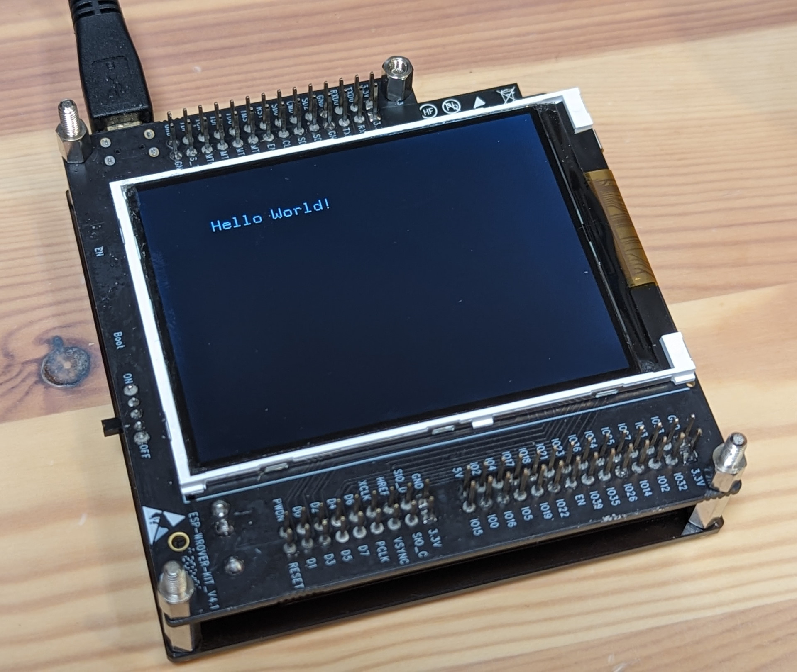

# Minimal LCD demonstration on ESP-WROVER-KIT (ILI9341)

## What is this?

This is a minimalist demonstration for using Ucglib on ESP-WROVER-KIT-VE (V1.4) with PlatformIO (Arduino framework).

ESP-WROVER-KIT is a reference evaluation board kit officially released by Espressif.
Useful beginnig with learning and understanding how to use ESP32 device architecture with reasonable cost.

You can choose for using Software-based SPI and Hardware-based SPI.
The method of composition is easily understood.
Hope this helps someone.

* ESP-WROVER-KIT (ESP-WROVER-KIT-VE (V1.4))
  * Getting started guide: https://docs.espressif.com/projects/esp-idf/en/latest/esp32/hw-reference/esp32/get-started-wrover-kit.html
  * Schematic: https://dl.espressif.com/dl/schematics/ESP-WROVER-KIT_V4_1.pdf
  * Distributor (Digikey): https://www.digikey.com/en/products/detail/espressif-systems/ESP-WROVER-KIT-VE/13584249
  * Distributor (Mouser): https://www.mouser.com/ProductDetail/?qs=KUoIvG%2F9Ilbci6DcltJYaA%3D%3D
* Ucglib: https://github.com/olikraus/ucglib

Results for running demo code:

## Note

* ESP-WROVER-KIT older version maybe doesn't run this demo code, because LCD controller is different.
* ESP-WROVER-KIT has connectivity of debugger. In other words, you can debug your ESP32 code from VSCode. If you want to use debugger:
  * you have to configure "Bit-bang JTAG mode" on the serial device driver. [See also: Configure ESP-WROVER-KIT JTAG Interface](https://docs.espressif.com/projects/esp-idf/en/latest/esp32/api-guides/jtag-debugging/configure-ft2232h-jtag.html).
  * Start debugging with F5 key instead of write icon (right arrow). Debugger takes a long time to connect to the device (especially the first time!). Wait patiently until the "DEBUG CONSOLE" tab appears.

## License

Under MIT.
